# CPE322: Lab 2 - Command Line

### hostname
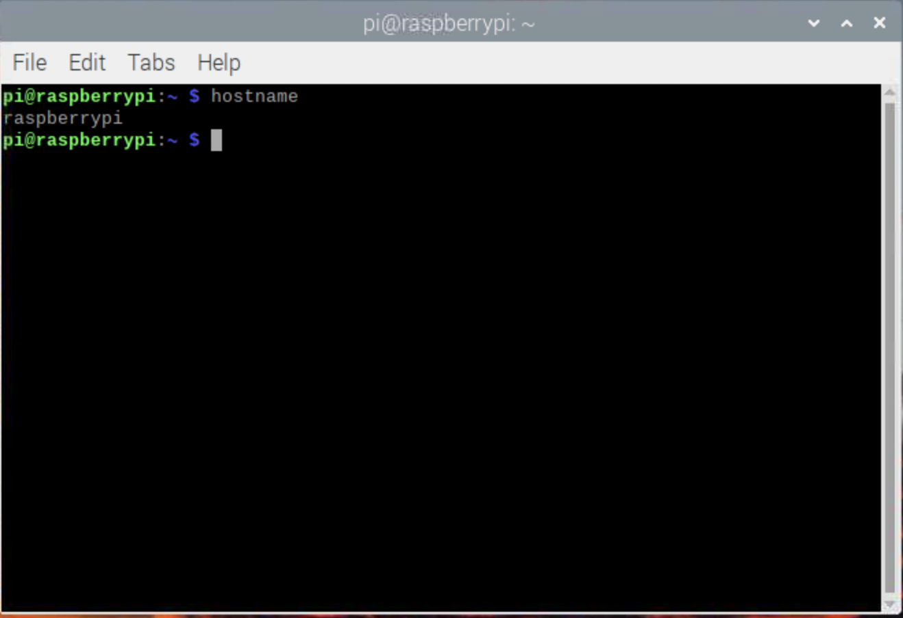

### env
***This command shows a list of environment variables***

### ps

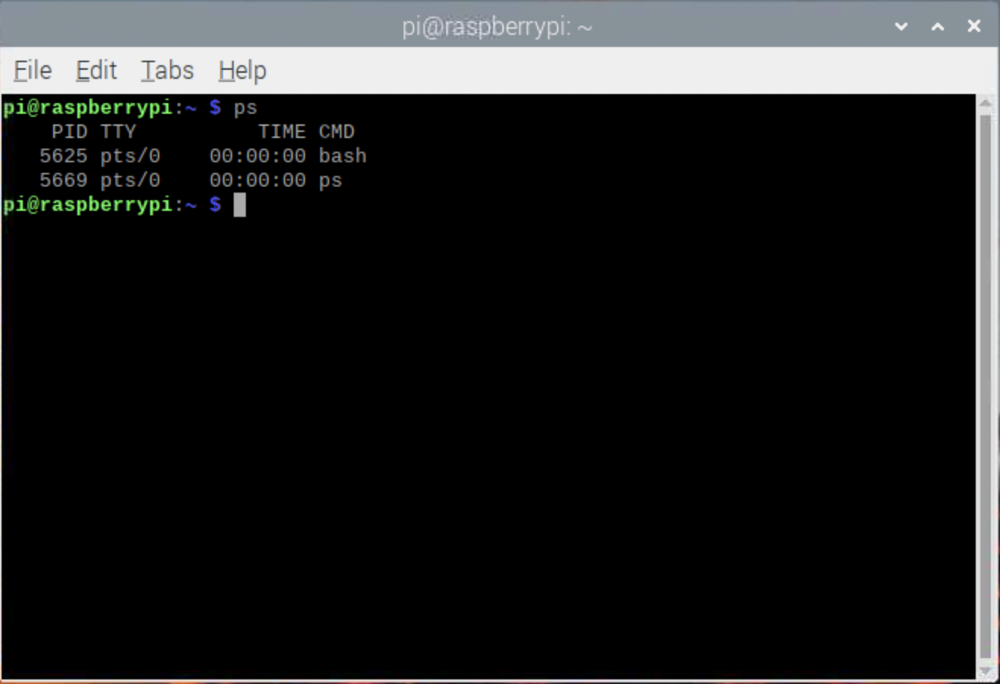

### pwd

### git clone
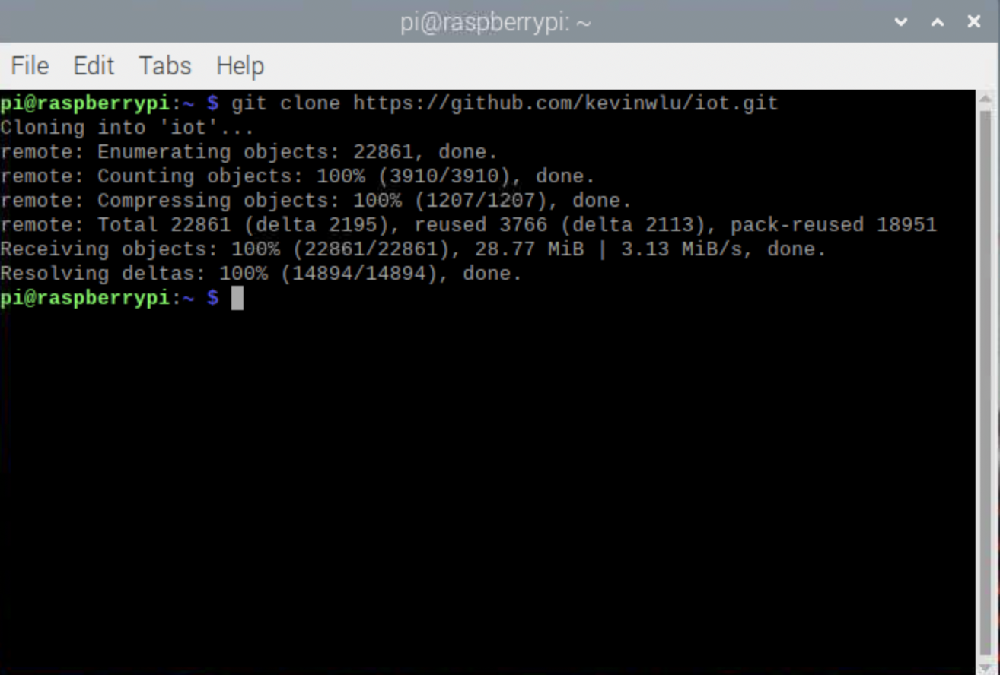

### cd iot/ls
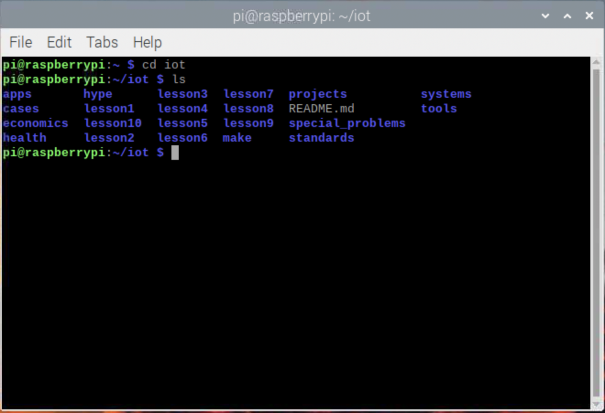

### cd ..

***This command goes back to the previous directory***

### df

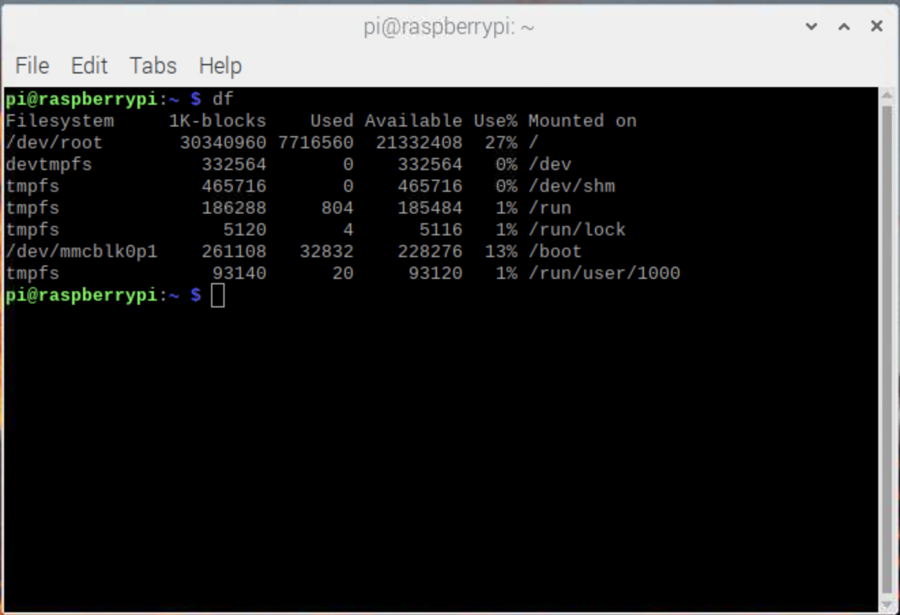

### mkdir demo/cd demo

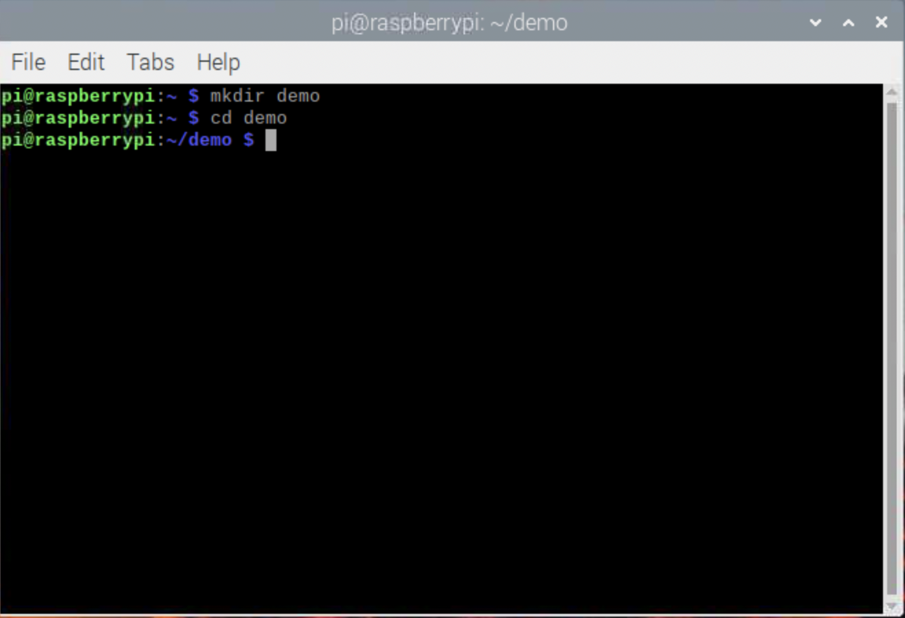

### nano file

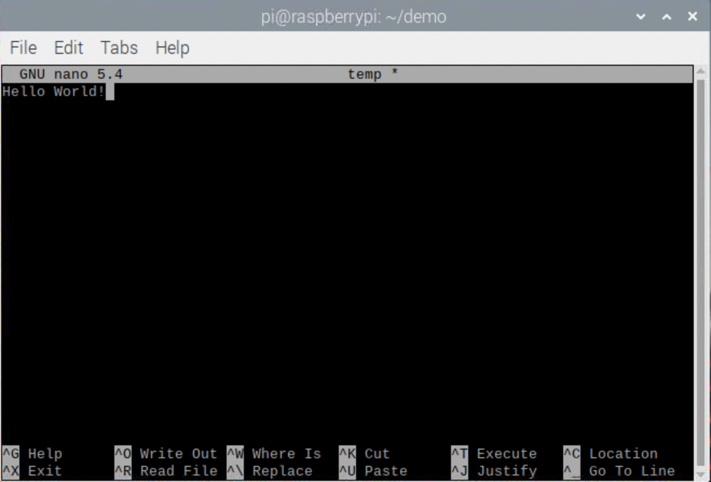

### cat file

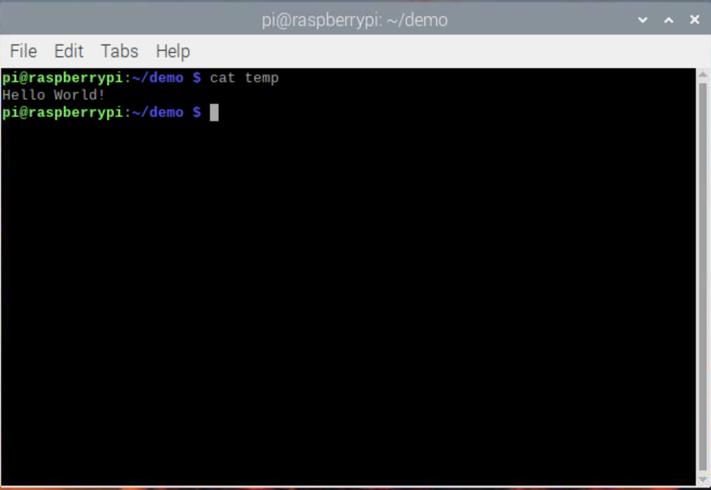

### cp file file1

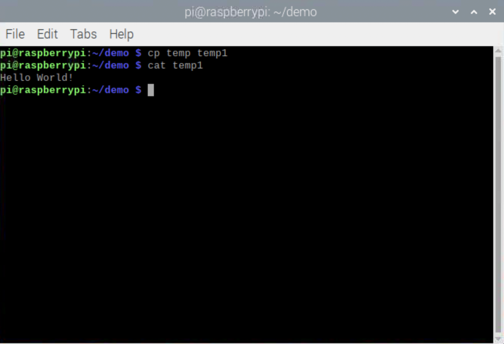

### mv file file2/rm file2

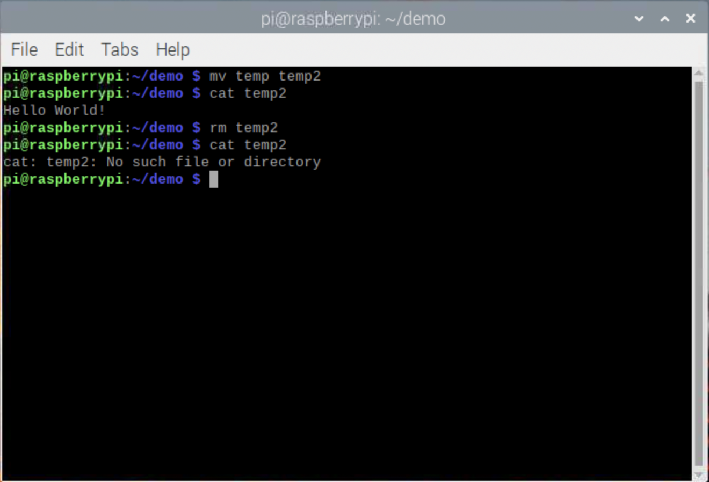

### clear

***This command clears the terminal***

### man unmae

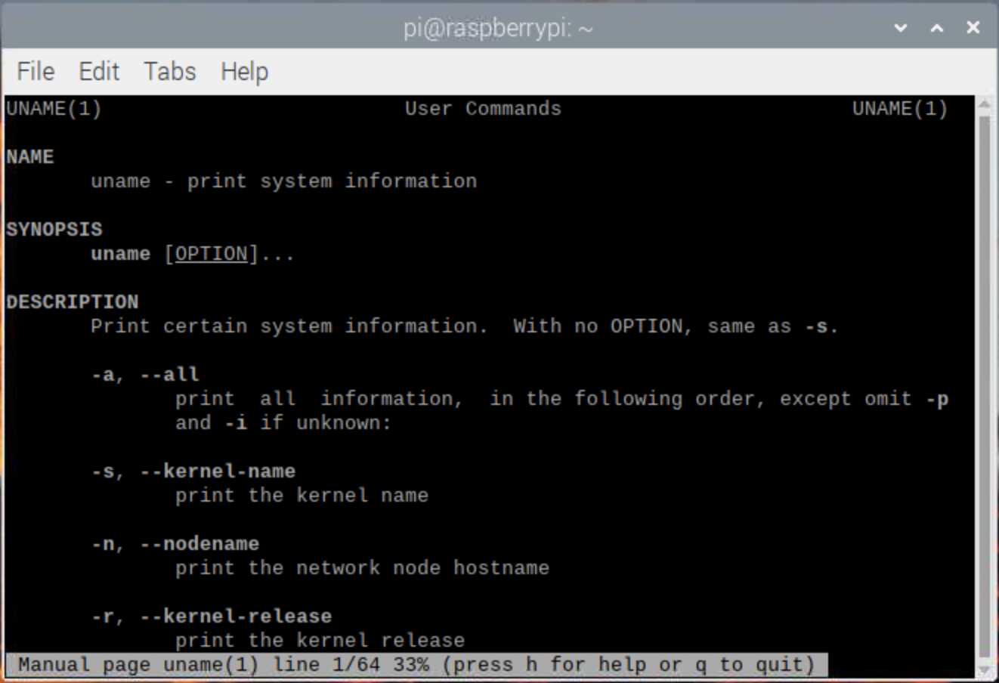

### uname -a

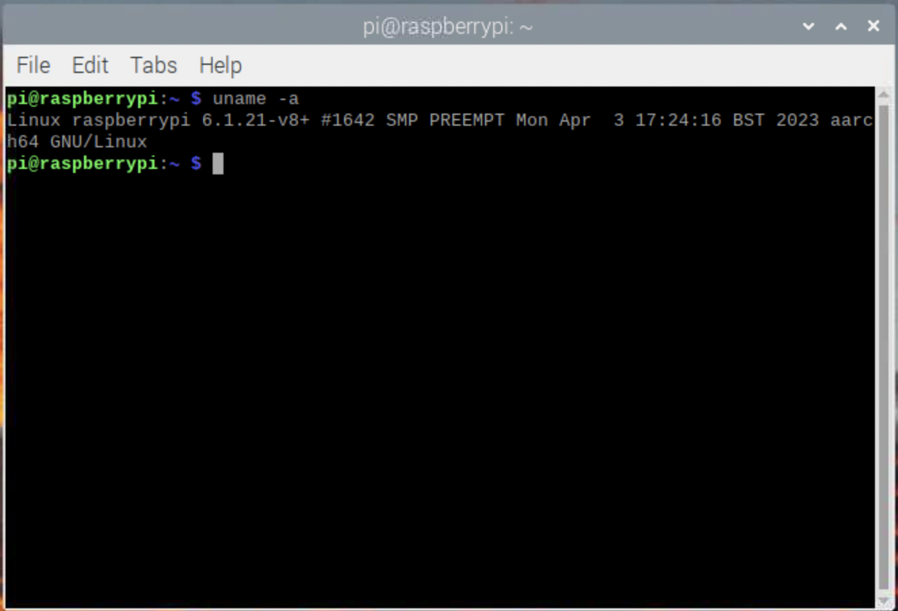

### ifconfig

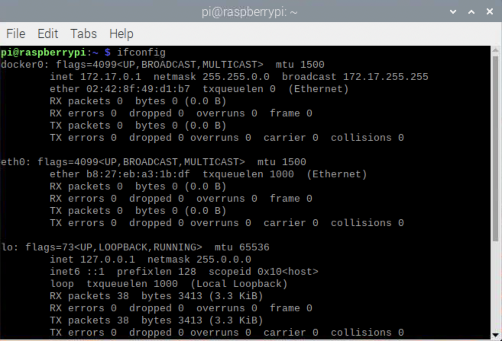

### ping localhost

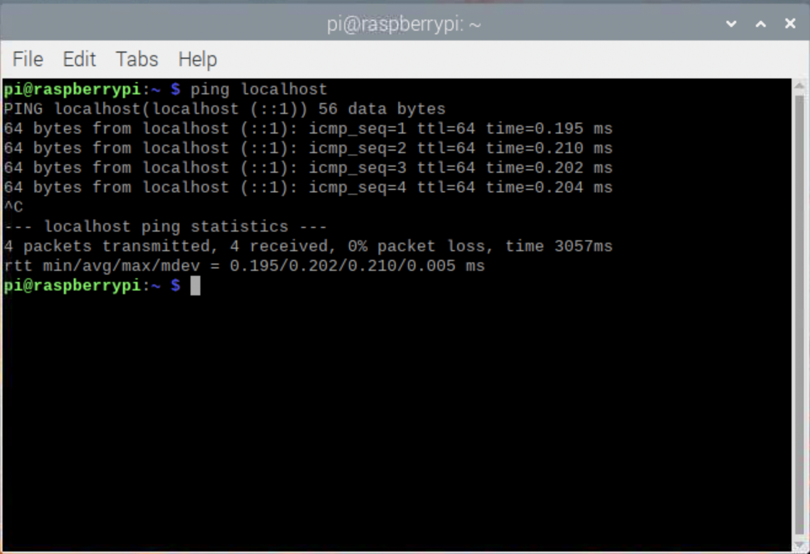

### netstat

***This command shows a list of TCP connections***

