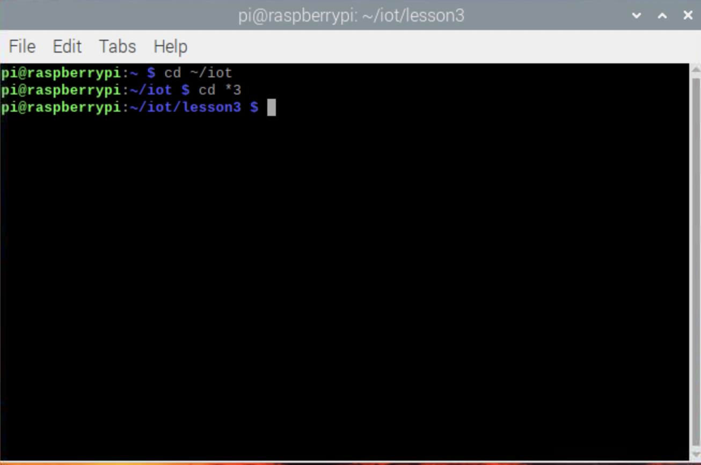

# CPE322: Lab 3 - Python

### cd ~/iot/cd *3

### python3 julian.py

### python3 date_example.py

### python3 datetime_example.py

### python3 time_example.py

### python3 sun.py "New York"

### python3 moon.py

### python3 coordinates.py "Samuel C. Williams Library"

### python3 address.py "40.74480675, -74.02532861159351"

### python3 cpu.py

### python3 battery.py

### python3 documentstats.py document.txt

